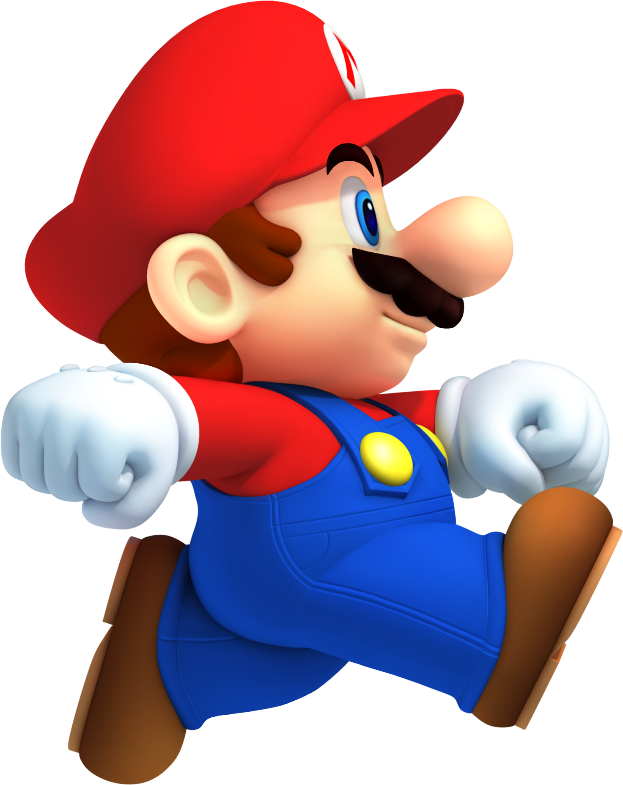

# RL Agent Maze Solve

A small **Q-learning** agent that learns to navigate a 2D maze, visualized live with **Pygame**. Watch a random-walking agent gradually turn into one that beelines for the goal, purely from trial-and-error rewards — no path-finding algorithm, no hardcoded route.



## How it works

The maze is an 11×15 grid, where each cell is one of:

| Value | Meaning       |
|-------|---------------|
| `0`   | Wall (blocked)|
| `1`   | Open path     |
| `2`   | Start tile    |

The agent starts at `START = (1, 1)` and must reach `GOAL = (9, 13)`. At every step it can move **up, down, left, or right**. Walking into a wall or off the grid keeps it in place and costs a penalty; reaching the goal ends the episode with a big reward.

### Q-learning in a nutshell

The agent keeps a **Q-table**: for every open cell, four numbers estimating "how good is it to go up / down / left / right from here?" It learns those numbers through repeated attempts (episodes):

1. **Choose an action** — with probability `epsilon`, move randomly (*explore*); otherwise pick the action with the highest known value for the current cell (*exploit*). This is the **epsilon-greedy** strategy.
2. **Take the step** and observe the reward:
   - `+100` for reaching the goal
   - `-10` for bumping into a wall/boundary
   - `-1` for an ordinary move (encourages shorter paths)
3. **Update the Q-table** using the Bellman equation:

   ```
   Q(s, a) ← Q(s, a) + α · [ r + γ · max(Q(s')) − Q(s, a) ]
   ```

   where `α` (alpha) is the learning rate and `γ` (gamma) is the discount factor for future rewards.
4. **Decay epsilon** slightly after each episode, so the agent explores a lot early on and increasingly relies on what it has learned as training progresses.

After enough episodes, the Q-table converges to values that encode the shortest safe path from any open cell to the goal.

### Files

| File | Purpose |
|------|---------|
| [q_learning.py](q_learning.py) | Core RL logic: the maze grid, reward rules (`step`), Q-table (`make_q_table`, `update`), action selection (`choose_action`), and a standalone `train()` / `best_path()` / `print_path()` flow you can run from the terminal (no graphics). |
| [main.py](main.py) | Pygame front-end. Draws the maze and the agent sprite, and drives training **one Q-learning step per rendered frame**, so you can watch the agent learn in real time. Once training finishes, it replays the best known path. |
| [agent.png](agent.png) | Sprite used to render the agent on the grid. |

## Running it

### With visualization (recommended)

```bash
python main.py
```

This opens a Pygame window and:
1. **Training phase** — runs 500 episodes, advancing the agent one step per frame at high speed. The HUD in the top-left shows the current episode and epsilon value.
2. **Replay phase** — once training ends, the window switches to walking the single best path greedily read from the final Q-table (slowed down so it's easy to follow).

Close the window (or press the OS window-close button) to quit.

### Headless / terminal only

```bash
python q_learning.py
```

Trains a fresh Q-table (2000 episodes by default) with no graphics, then prints the maze in ASCII with the learned path marked:

```
S = start        G = goal
* = learned path # = wall
. = open, unused path
```

## Requirements

- Python 3.10+
- [pygame-ce](https://pyga.me/) (only needed for `main.py`)

Install into a virtual environment:

```bash
python -m venv .venv
source .venv/bin/activate   # on Windows: .venv\Scripts\activate
pip install pygame-ce
```

> **Why `pygame-ce` and not `pygame`?** On very new Python versions (e.g. 3.14), PyPI may not yet have a prebuilt `pygame` wheel, so `pip` silently compiles one from source without image-format support (`PNG`/`JPG`) — `pygame.image.load()` then only accepts `.bmp` files and fails on `agent.png` with `pygame.error: File is not a Windows BMP file`. `pygame-ce` is a drop-in, actively maintained fork with the same `import pygame` API, and it ships prebuilt wheels with full PNG support sooner after each Python release. If you already have a working `pygame` install with PNG support, it works fine too.

## Tuning

Both `main.py` and `q_learning.py` expose the same hyperparameters near the top of the file (or as `train()` arguments):

| Parameter | Default | Meaning |
|-----------|---------|---------|
| `EPISODES` | 500 (`main.py`) / 2000 (`q_learning.py`) | Number of training attempts |
| `ALPHA` | 0.1 | Learning rate — how much each update shifts the Q-value |
| `GAMMA` | 0.9 | Discount factor — how much future rewards matter |
| `EPS_MIN` / `EPS_DECAY` | 0.05 / 0.995 | Epsilon floor and per-episode decay rate |
| `MAX_STEPS` | 500 | Steps allowed per episode before it's cut short |

Feel free to edit the `maze_grid` in either file to try a different layout — just keep `START` and `GOAL` on open (`1`/`2`) tiles.
